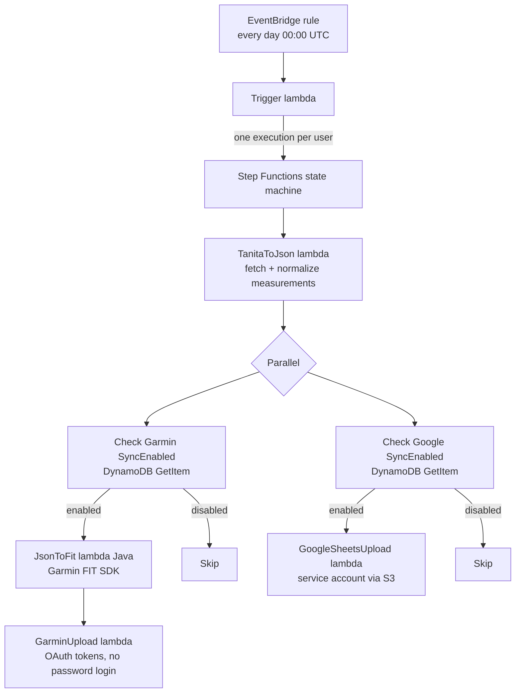

# tanita-to-garmin-cdk

Serverless AWS application (CDK, TypeScript) that syncs body-composition
measurements from a **Tanita** scale (via the mytanita.eu API) to
**Garmin Connect** and/or **Google Sheets**, once a day, per user.

## Architecture



1. An EventBridge cron rule fires the **Trigger** lambda at midnight UTC. It
   lists every user in the DynamoDB table and starts one state-machine
   execution per user with `{ userId, start_date: yesterday, end_date: today }`.
2. **TanitaToJson** reads the user's Tanita credentials from DynamoDB, logs in
   to the mytanita.eu API, downloads the measurements for the date range and
   normalizes them to JSON (weight, BMI, body fat, muscle mass, …).
3. Two parallel branches check the per-service `SyncEnabled` flag and, when
   enabled:
   - **Garmin**: a Java 11 lambda converts the JSON to a binary `.fit` file
     using the Garmin FIT SDK, and **GarminUpload** uploads it to Garmin
     Connect using stored OAuth tokens.
   - **Google Sheets**: **GoogleSheetsUpload** appends one row per measurement
     to the configured spreadsheet, authenticating with a service-account key
     stored in S3.

## Data model (DynamoDB single table)

| PK             | SK            | Attributes                                                        |
| -------------- | ------------- | ----------------------------------------------------------------- |
| `USER#<uuid>`  | `#INFO`       | `Username`                                                        |
| `USER#<uuid>`  | `CRED#TANITA` | `User`, `Pass`, `Profile`, `SyncEnabled`                          |
| `USER#<uuid>`  | `CRED#GARMIN` | `User`, `Pass`, `OAuth1Token`, `OAuth2Token`, `SyncEnabled`       |
| `USER#<uuid>`  | `CRED#GOOGLE` | `SheetId`, `SheetIndex`, `SyncEnabled`                            |

A GSI (`UsernameIndex`, partition key `SK`) lets the trigger lambda list all
users by querying `SK = '#INFO'`.

## Garmin authentication (important)

Garmin rate-limits password logins coming from cloud/datacenter IPs with
`429 Too Many Requests`, so the GarminUpload lambda **never logs in with a
password**. It authenticates with OAuth tokens stored in the `CRED#GARMIN`
item and persists them back after every run (the OAuth2 access token is
auto-refreshed by the `garmin-connect` client using the OAuth1 token).

Seed the tokens by running the login **once from a residential IP** (not from
a VPN or cloud machine):

```sh
AWS_PROFILE=<profile> USERS_TABLE=<UsersTableName> npm run garmin:token -- <userId>
```

The script reads the Garmin username/password from the user's `CRED#GARMIN`
item, performs the browser-equivalent login, and stores `OAuth1Token` and
`OAuth2Token` in the same item. The OAuth1 token lasts roughly **one year**;
re-run the script when it expires (the nightly execution will start failing
with a "Missing Garmin OAuth tokens" or refresh error).

## Google Sheets authentication

The GoogleSheetsUpload lambda loads a Google service-account key from S3
(`credentials/tanita.json` in the bucket created by the stack). Share the
target spreadsheet with the service-account email and set `SheetId` and
`SheetIndex` in the user's `CRED#GOOGLE` item.

## Onboarding a user

1. Insert the four items shown in the data model above (see
   `src/lambdas/ts/seedData/index.ts` for the exact shape).
2. Set `SyncEnabled: true` on the services you want.
3. For Garmin, seed the OAuth tokens (see above).

## Development

```sh
npm install        # install dependencies
npm run build      # type-check and compile
npm test           # jest (synthesizes the stack; no AWS credentials needed)
npx cdk synth      # emit CloudFormation (requires Maven for the Java lambda)
npx cdk deploy     # deploy to the AWS account of the active profile
```

The Java FIT lambda is built by `cdk_hooks.sh` (invoked automatically before
synth), which installs `libs/fit.jar` as a local Maven artifact and runs
`mvn package`. Tests don't need Maven: they synthesize against a placeholder
jar.

## CI/CD

GitHub Actions (`.github/workflows/cdk-deploy.yml`):

- **Pull requests**: build + tests only.
- **Push to `main`**: build + tests, then `cdk deploy` to the account
  configured in the repo secrets (`AWS_ACCESS_KEY_ID`,
  `AWS_SECRET_ACCESS_KEY`) and the `AWS_REGION` repo variable.

## Operations

- Executions run at 00:00 UTC. Check the Step Functions console for
  `FAILED` executions; both sync lambdas propagate errors, so a failed
  upload shows up as a failed execution (nothing is swallowed).
- Lambda logs live in CloudWatch under
  `/aws/lambda/TanitaToGarminCdkStack-*`.
- The DynamoDB table and the credentials bucket are retained
  (`RemovalPolicy.RETAIN`) if the stack is destroyed.
